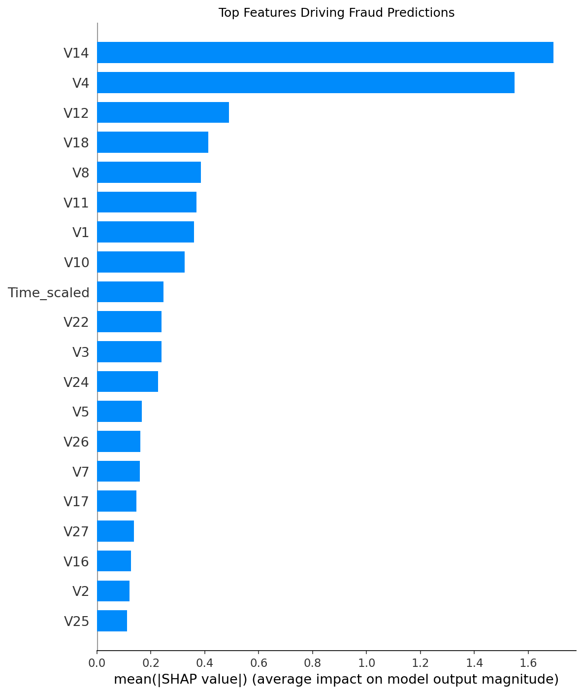

#  Credit Card Fraud Detection System

A complete end-to-end machine learning system that detects 
fraudulent credit card transactions in real time.

---

##  Problem Statement
Credit card fraud costs billions annually. This system flags 
suspicious transactions in real time using machine learning, 
with explainable AI to justify every decision.

---

##  Project Architecture
Data → EDA → Modeling → SHAP Explainability → FastAPI → Streamlit UI
---

##  Dataset
- 284,807 transactions over 2 days
- Only 492 fraudulent (0.17%) — severe class imbalance
- Features V1–V28 are PCA-transformed for privacy
- Source: [Kaggle Credit Card Fraud Dataset](https://www.kaggle.com/datasets/mlg-ulb/creditcardfraud)

---

##  Approach

### Handling Class Imbalance
Compared three techniques:
| Technique | PR-AUC |
|---|---|
| No handling (baseline) | ~0.06 |
| Class Weights | ~0.71 |
| Undersampling | ~0.68 |
| SMOTE | ~0.85 |

### Models Compared
| Model | PR-AUC | ROC-AUC |
|---|---|---|
| Logistic Regression | ~0.71 | ~0.97 |
| Random Forest | ~0.87 | ~0.98 |
| XGBoost | ~0.85 | ~0.98 |

 **Best Model: Random Forest with SMOTE**

---

##  Explainability
Used SHAP (SHapley Additive exPlanations) to explain 
individual predictions — critical for real-world deployment 
where decisions must be justified.



---

##  How to Run

### 1. Clone the repo
```bash
git clone https://github.com/tanmay2729/fraud-detection.git
cd fraud-detection
```

### 2. Install dependencies
```bash
pip install -r requirements.txt
```

### 3. Run the Streamlit App
```bash
streamlit run streamlit_app.py
```

### 4. Run the API
```bash
cd api
uvicorn app:app --reload
```
API docs available at: `http://localhost:8000/docs`

---

##  Tech Stack
- **ML:** scikit-learn, XGBoost, imbalanced-learn
- **Explainability:** SHAP
- **API:** FastAPI, Uvicorn
- **UI:** Streamlit
- **Other:** pandas, numpy, matplotlib, seaborn, joblib

---
